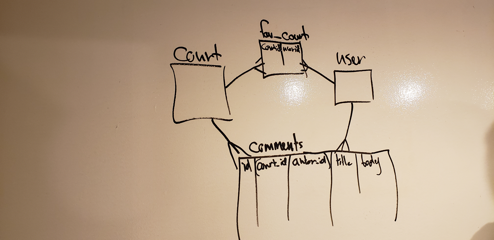
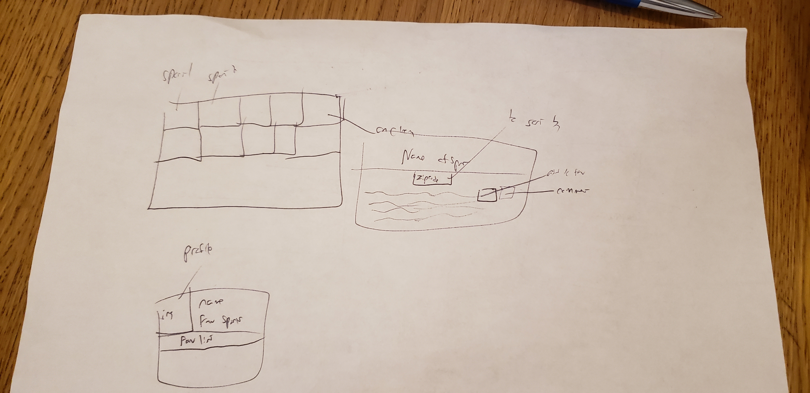

# README

# NYC-Sports

Using data from the cityofnewyork.us for locations and informations of all public handball courts, tennis courts, ice skating rink, indoor swimming pool, beaches, cricket courts and bocce courts. We will let the user edit their profile with name and image as well as comment on a sport location and rate it and add to their favorites. Let user filter based on sport and further sort sort by zip code.

## Technologies to be used
* ruby on backend coding to read json files and write to db
* postgresql for db storage
* javascript for front end coding
* react native for front end display
* ruby on rails for backend

## ERD
Handball courts, tennis courts, ice skating rink, indoor swimming pool, beaches, cricket courts and bocce courts
for each of those will be the data from the json file downloaded from. each of these will be a table of its own

# WireFrames

## MVP
* Lets a user create a profile with name and profile pic and list
* Have user register
* Lets user comment once and rate a sport place location
* render all sports and let user filter based on sports and further order based on zip code
* Lets user add a spot to their favorite list

## Post MVP
Add mapbox to show location in a map
Let users see others user who have same interest in sport
